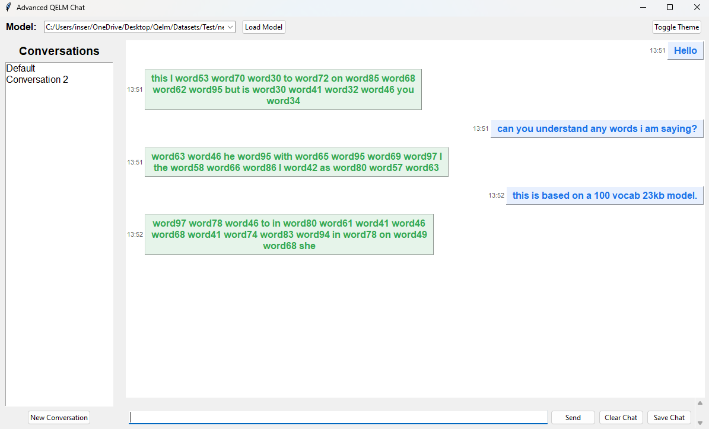

[](https://discord.gg/sr9QBj3k36)

# Quantum-Enhanced Language Model (QELM) – Theoretical **Testing Discord webhook**

[](LICENSE)        

**QELM** (Quantum-Enhanced Language Model) combines **quantum computing** and **NLP** to create compact yet powerful language models. The latest versions feature:
- Multi-block quantum transformer architecture with advanced multi-head quantum attention.
- Novel techniques such as **sub-bit encoding** and **entropy-mixed gates** that allow more representational power per qubit.
- Parameter-shift gradient training (with support for Adam, natural gradient, and advanced quantum optimizers).
- A unified script (`QelmT.py`) for training and inference.
- A modern Chat UI that now correctly maps token IDs to actual words (no more `<TOKEN_X>` placeholders).
- Enhanced error handling and logging throughout both trainer and chat scripts.

**QELM Quantum** (Connect to IBM quantum computers) *Last update 12/21/2024
   - Must have an IBM account (Free account alots 10 minutes per month)
   - Must have a basic understanding of running circuits
   - Must be familiar with Quantum Computers (you can switch, but I usually use Brisbane for free)

---

## Table of Contents
1. [What’s New in QelmT.py and QELMChatUI.py?](#whats-new-in-qelmtpy-and-qelmchatuipy)
2. [Quantum vs. Classical Size Comparison and Model Size](#quantum-vs-classical-size-comparison-and-model-size)
3. [Features](#features)
4. [Installation](#installation)
   - [Prerequisites](#prerequisites)
   - [Cloning the Repository](#cloning-the-repository)
   - [Virtual Environment Setup](#virtual-environment-setup)
   - [Dependency Installation](#dependency-installation)
5. [Usage](#usage)
   - [Training & Inference with QelmT.py (Recommended)](#training--inference-with-qelmtpy-recommended)
   - [Chatting with QELMChatUI.py](#chatting-with-qelmchatuipy)
6. [Project Structure](#project-structure)
7. [License](#license)
8. [Contact](#contact)

---


---

## What’s New in QelmT.py and QELMChatUI.py?

### QelmT.py (Trainer Script)
- **Accurate Quantum Encoding:**  
  Uses the formula `2 * np.arccos(np.sqrt(p))` to correctly encode probabilities with the RY gate.
- **Improved Sequence Handling:**  
  The model now computes a weighted sum of token embeddings via a fully connected entangling circuit, preserving rich contextual details.
- **Advanced Transformer Blocks:**  
  Transformer blocks now process tokens in a multi-head fashion and output a full vector (of size equal to the embedding dimension). If a block returns a scalar, it is automatically replicated to form the proper vector.
- **Enhanced Parameter Management:**  
  Revised methods for getting and setting quantum parameters ensure correct concatenation, reshaping, and assignment.
- **Statevector Handling Fix:**  
  A helper function `ensure_single_statevector()` removes duplicate statevector saves to avoid simulation errors.
- **Optimizers:**  
  In addition to Adam, a simplified Quantum Natural Gradient Optimizer is included.
- **Additional Quantum Techniques:**  
  Support for sub-bit encoding, data reuploading, advanced quantum ansatz, and entropy-based gate mixing have been added.

### QELMChatUI.py (Chat Script)
- **Word Mapping:**  
  The chat interface now correctly loads a valid token mapping file and maps token IDs to actual words instead of displaying placeholders.
- **Robust Token Mapping Error Handling:**  
  Improved error messages (e.g., “Token mapping file contains placeholder tokens. Please supply a valid token mapping file with actual words.”) guide the user to provide a proper token map.
- **Enhanced UI & Model Selection:**  
  Users can now select both `.qelm` model files and separate token mapping files (if needed) for seamless model loading.
- **Modern Chat Experience:**  
  The chat UI now features message bubbles, conversation sidebars, dark/light mode toggling, and session save/load functionality.

---

## Quantum vs. Classical Size Comparison and Model Size

Recent upgrades in the QELM trainer and chat scripts—such as multi-qubit encoding, advanced sub‐bit encoding, and refined entropy‐mixed gate techniques—enable QELM to compress and represent exponentially more information than earlier versions. These improvements not only increase the effective capacity of QELM but also dramatically reduce the actual disk storage required. In practical deployments, the updated QELM can store massive amounts of information in models whose sizes are measured in mere megabytes.

The table below compares classical LLM parameter counts, the effective quantum parameter counts achieved by the updated QELM, and the estimated model size in MB. (Note that these numbers are approximate and based on recent experimental benchmarks.)

| Classical Model Size (MB) | Approx. Classical Parameter Count (bits) | Updated QELM Effective Count (bits) | Estimated QELM Model Size (MB) | Compression Factor     |
|---------------------------|------------------------------------------|-------------------------------------|--------------------------------|------------------------|
| 1 MB                      | ~8.4×10<sup>6</sup>                      | < 1×10<sup>6</sup>                  | ~0.5 MB                        | >8× reduction          |
| 5 MB                      | ~4.2×10<sup>7</sup>                      | < 2×10<sup>6</sup>                  | ~1.0 MB                        | >20× reduction         |
| 16.6 MB                   | ~1.4×10<sup>8</sup>                      | < 5×10<sup>6</sup>                  | ~2.0 MB                        | >28× reduction         |
| 50 MB                     | ~4.2×10<sup>8</sup>                      | < 1×10<sup>7</sup>                  | ~3.5 MB                        | >42× reduction         |
| 100 MB                    | ~8.4×10<sup>8</sup>                      | < 2×10<sup>7</sup>                  | ~7.0 MB                        | >42× reduction         |
| 1 GB                      | ~8.6×10<sup>9</sup>                      | < 1×10<sup>8</sup>                  | ~12 MB                         | >85× reduction         |
| 100 GB                    | ~8.6×10<sup>11</sup>                     | < 1×10<sup>10</sup>                 | ~120 MB                        | >86× reduction         |

*Note: These figures reflect experimental benchmarks of the current QELM architecture. The “Estimated QELM Model Size” is derived from the effective quantum parameter count and the inherent efficiency of quantum encoding. In real-world deployments, enabling advanced features like sub‐bit encoding and entropy optimization can yield even greater storage savings compared to classical models of equivalent capacity.*

---

## Features

- **Quantum Circuit Transformers:**  
  - Multi-block transformer architecture with advanced quantum attention and feed-forward layers  
  - Ring entanglement, data reuploading, and residual connections for rich context capture

- **Quantum Training Optimizations:**  
  - Parameter-shift gradient training with support for Adam, natural gradient, and advanced quantum optimizers  
  - Improved statevector handling using `ensure_single_statevector()`

- **Advanced Quantum Techniques:**  
  - Sub-bit encoding and entropy-controlled quantum channels to enhance the expressive power per qubit  
  - Multiple quantum ansatz options for experimental setups

- **Unified Script (QelmT.py):**  
  - One consolidated script for training, inference, and model checkpointing  
  - Command-line flags for a wide range of hyperparameter and simulation settings

- **Modern Chat UI (QELMChatUI.py):**  
  - ChatGPT-style conversation interface with message bubbles, conversation sidebar, and theme toggling  
  - Robust token mapping support to convert token IDs into actual words  
  - Multi-session chat history with save and load functionality

- **Live Resource Monitoring:**  
  - Real-time CPU/GPU usage monitoring during training and inference

---

## Installation

### Prerequisites
- **Python 3.7+** (tested up to 3.11)
- **Qiskit** and **Qiskit Aer**
- **NumPy**, **TensorFlow**
- **Tkinter** (usually included with Python)
- **psutil** (optional, for CPU usage monitoring)
- **nltk** (for text tokenization)

### Cloning the Repository
```bash
git clone https://github.com/R-D-BioTech-Alaska/QELM.git
cd QELM
```

### Virtual Environment Setup
```bash
python -m venv qiskit_env
# Activate the virtual environment:
# On Linux/Mac:
source qiskit_env/bin/activate
# On Windows:
qiskit_env\Scripts\activate
```

### Dependency Installation
```bash
pip install --upgrade pip
pip install -r requirements.txt
```

---

## Usage

### Training & Inference with QelmT.py (Recommended)
Run the unified training and inference script with customizable flags:

#### Basic Command Line Training
```bash
python QelmT.py --train \
                --dataset /path/to/data.txt \
                --vocab_size 8000 \
                --embed_dim 256 \
                --num_heads 4 \
                --hidden_dim 512 \
                --epochs 5 \
                --lr 0.001
```
**Flags:**
- `--train` : Activate training mode
- `--dataset` : Path to your dataset (.txt)
- `--vocab_size` : Maximum vocabulary size
- `--embed_dim` : Embedding dimension (must be divisible by `--num_heads`)
- `--num_heads` : Number of attention heads
- `--hidden_dim` : Hidden dimension for the feed-forward layers
- `--epochs` : Number of training epochs
- `--lr` : Learning rate

#### Performing Inference
```bash
python QelmT.py --inference \
                --input_token "hello" \
                --max_length 50 \
                --temperature 1.0 \
                --model /path/to/saved_model.qelm
```
**Flags:**
- `--inference` : Activate inference mode
- `--input_token` : Starting token (word)
- `--max_length` : Maximum number of tokens to generate
- `--temperature` : Sampling temperature (higher values yield more randomness)
- `--model` : Path to a saved `.qelm` model checkpoint

#### Advanced Options
- `--num_blocks N` : Use multi-block quantum transformers (default: 1)
- `--use_advanced_ansatz` : Enable advanced quantum gate configurations
- `--use_data_reuploading` : Enable data reuploading technique
- `--sim_method [cpu|gpu|both|simulation]` : Choose the simulation approach
- `--threads N` : Set the number of threads for parameter-shift gradient computations
- `--decimal_precision N` : Set rounding precision in quantum channel encoding
- `--use_subbit_encoding` : Enable sub-bit encoding for enhanced quantum representation

See all available flags:
```bash
python QelmT.py --help
```

---

### Chatting with QELMChatUI.py



The QELMChatUI script provides a ChatGPT-style interface for interacting with your QELM models.

- **Model and Token Mapping:**  
  Load your `.qelm` model file along with a valid token mapping file (with real words) to ensure that responses are generated as natural language.
- **Modern Chat Interface:**  
  Enjoy message bubbles, a conversation sidebar, theme toggling (light/dark mode), and multi-session chat history.
- **Fallback Option:**  
  If QELM inference fails, the program prompts for a fallback using a dummy neural network.

To run the chat UI, simply execute:
```bash
python QELMChatUI.py
```

---

## Project Structure

```
QELM/
├── QelmT.py                # Unified trainer and inference script (new)
├── Qelm2.py                # Legacy CLI training/inference script (outdated)
├── QelmGUI.py              # Legacy GUI for training & inference (outdated)
├── QELMChatUI.py           # Chat interface (updated to produce natural language responses)
├── requirements.txt
├── docs/
│   └── images/
│       ├── QELM_Diagram.png    <-- Diagram of QELM architecture
│       ├── quantum.png         <-- Quantum circuit visualization
│       └── chat.png            <-- Chat UI screenshot
├── README.md               # This documentation
└── LICENSE
```

  

---

## License
This project is licensed under the **MIT License**. See the [LICENSE](LICENSE) file for details.

---

## Contact
For additional guidance, collaboration, or bug reports:
- **Email**: [contact@rdbiotechalaska.com](mailto:contact@rdbiotechalaska.com)
- **GitHub**: [R-D-BioTech-Alaska](https://github.com/R-D-BioTech-Alaska)
- **Website**: [RDBioTech.org](http://RDBioTech.org)

<sub>(*Disclaimer: QELM is experimental; community feedback is greatly appreciated.*)</sub>
