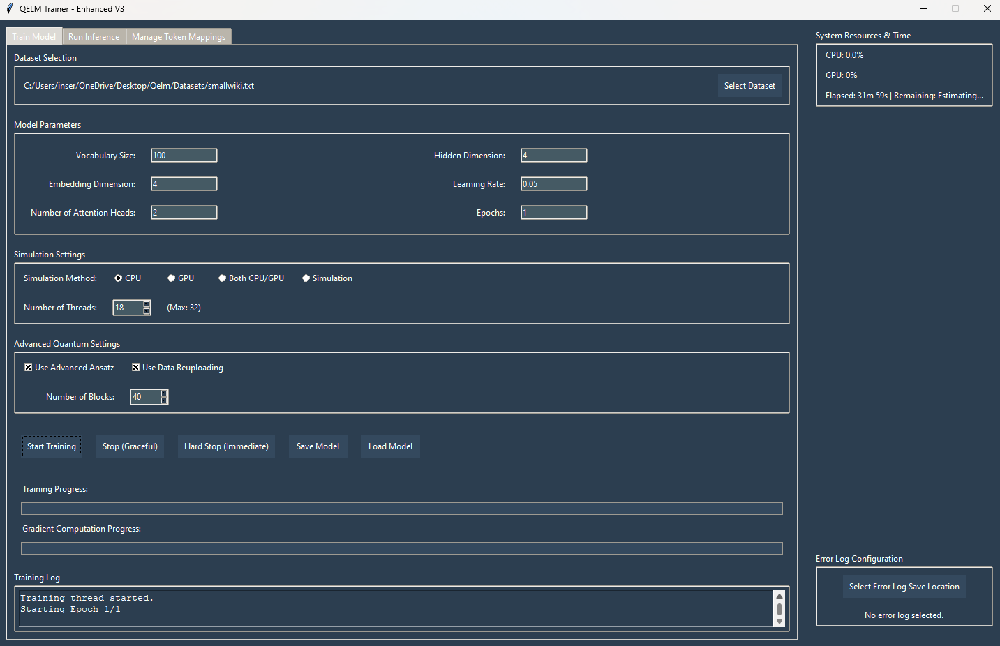
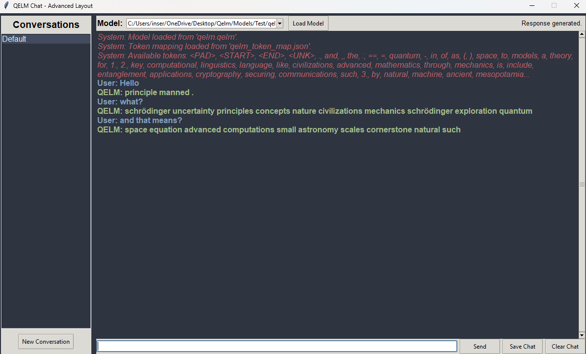

# Quantum-Enhanced Language Model (QELM) (QLM)


## Table of Contents
- [Overview](#overview)
- [Comparison with Regular LLMs](#comparison-with-regular-llms)
- [Features](#features)
- [Installation](#installation)
  - [Prerequisites](#prerequisites)
  - [Clone the Repository](#clone-the-repository)
  - [Setup Virtual Environment](#setup-virtual-environment)
  - [Install Dependencies](#install-dependencies)
- [Usage](#usage)
  - [Training the Model](#training-the-model)
  - [Performing Inference](#performing-inference)
  - [Graphical Interfaces](#graphical-interfaces)
    - [1. QelmGUI (Training + Inference)](#1-qelmgui-training--inference)
    - [2. QELMChatUI (Conversational UI)](#2-qelmchatui-conversational-ui)
  - [Legacy Command Line (Older Script)](#legacy-command-line-older-script)
  - [Viewing Help/Usage](#viewing-helpusage)
- [Project Structure](#project-structure)
- [Credits](#credits)
- [License](#license)
- [Contact](#contact)

---

## Overview
The **Quantum-Enhanced Language Model (QELM)** merges **quantum computing** with natural language processing to produce extremely **compact** yet powerful language models. By encoding token embeddings into **quantum states** and leveraging **entanglement**, QELM drastically reduces storage requirements compared to classical LLMs. This makes QELM an excellent choice for edge devices or memory-limited environments.  
Moreover, the newest code introduces **multi-block** quantum transformer structures, **ring entanglement**, optional **data reuploading**, and the **Parameter-Shift Rule** for gradient-based quantum training, all in an easy-to-explore environment.

---

## Comparison with Regular LLMs
Classical LLMs often reach **6 - 60 GB** (or more) even for modest architectures.
In our original comparison tests, utilizing the same embeddings and parameters to train a model QELM typically yields models around **2 MB** when a classical LLM would be **15-20** MB, delivering:
- **8–9x size reduction**  
- Similar perplexity/performance (e.g., perplexity ~100)  
- Efficient parameter usage through quantum ansätze and ring entanglement  

However
In our most recent training programs we've been capable of much more effecient encoding of qubit layers in simulations. Currently we are able to express 13.69 bytes per qubit. 
Overhead for Quantum circuit architecture for each QC is larger in the beginning until the model gets to around 16 mb's. At this point the Qelm begins to get smaller than the comparison of a regular trained llm.
This delivers a much larger difference in size and speed:

| Classical Size | LLM (bits)                   | QELM (bits)                               | QELM (MB)                 | QELM (GB)                 | Relationship         |
|----------------|------------------------------|-------------------------------------------|---------------------------|---------------------------|----------------------|
| 1 MB           | \(8.39 \times 10^6\)         | \(8.44 \times 10^7\)                      | ~10.06 MB                 | ~0.0099 GB                | QELM >> LLM          |
| 5 MB           | \(4.19 \times 10^7\)         | \(9.84 \times 10^7\)                      | ~11.72 MB                 | ~0.0115 GB                | QELM > LLM           |
| 10 MB          | \(8.39 \times 10^7\)         | \(1.16 \times 10^8\)                      | ~13.81 MB                 | ~0.0135 GB                | QELM > LLM           |
| 16.6 MB        | \(1.39 \times 10^8\)         | \(1.39 \times 10^8\)                      | ~16.60 MB                 | ~0.0162 GB                | QELM ≈ LLM           |
| 20 MB          | \(1.68 \times 10^8\)         | \(1.51 \times 10^8\)                      | ~18.00 MB                 | ~0.0176 GB                | QELM < LLM           |
| 50 MB          | \(4.19 \times 10^8\)         | \(2.56 \times 10^8\)                      | ~30.50 MB                 | ~0.0298 GB                | QELM << LLM          |
| 100 MB         | \(8.39 \times 10^8\)         | \(4.31 \times 10^8\)                      | ~51.39 MB                 | ~0.0501 GB                | QELM << LLM          |
| 1 GB           | \(8.59 \times 10^9\)         | \(3.67 \times 10^9\)                      | ~437.44 MB                | ~0.4274 GB                | QELM << LLM          |
| 10 GB          | \(8.59 \times 10^{10}\)      | \(3.59 \times 10^{10}\)                   | ~4285.5 MB                | ~4.183 GB                 | QELM << LLM          |
| 100 GB         | \(8.59 \times 10^{11}\)      | \(3.59 \times 10^{11}\)                   | ~42,740 MB                | ~41.74 GB                 | QELM << LLM          |

In short, quantum-based “compression” can significantly reduce overhead without compromising on capabilities.


---

## Features
- **Sophisticated Quantum Circuits**  
  - **Advanced Ansatz**: RY, RZ, ring entanglement patterns, optional data reuploading  
  - **Multi-Block Transformers**: Stack attention+FFN blocks for deeper language understanding  
  - **Parameter Shift Gradient** training for quantum gates (supports multi-threading)  
- **GUI Support**  
  - **QelmGUI**: Train/infer on quantum LLMs with real-time logs, progress bars, resource tracking  
  - **QELMChatUI**: Chat-like interface for multi-turn conversations, model selection, and conversation saving  
- **Multi-Threaded / Multiprocessing**  
  - Parallel parameter-shift evaluations to speed up training  
  - CPU/GPU/both simulation modes for flexible performance  
- **Dataset Flexibility**  
  - Load real text or generate synthetic tokens  
  - Manage token mappings easily in the integrated GUIs or via JSON  
- **Resource Monitoring**  
  - CPU usage via `psutil`  
  - GPU usage (if available) with `nvidia-smi`

---

---
## Installation

### Prerequisites
- **Python 3.7+** (up to 3.11 tested)
- **Qiskit** + **Qiskit Aer**
- **TensorFlow**
- **NumPy**
- **Tkinter** (standard in most Python distributions)
- **psutil** *(optional for resource usage)*

### Clone the Repository
```bash
git clone https://github.com/R-D-BioTech-Alaska/QELM.git
cd QELM
```

### Setup Virtual Environment
```bash
python -m venv qiskit_env
# Activate the env:
source qiskit_env/bin/activate     # Linux/macOS
qiskit_env\Scripts\activate        # Windows
```

### Install Dependencies
```bash
pip install --upgrade pip
pip install -r requirements.txt
```

---

## Usage

### Training the Model
1. **Prepare your dataset**: real text or synthetic (auto-generated).
2. **Set hyperparameters**: vocabulary size, embedding dimension, #heads, #blocks, advanced ansatz toggles, etc.
3. **Run training**:
   - **GUI**: Launch `QelmGUI.py`, fill in parameters, press **Start Training** (real-time logging and progress).
   - **CLI** (Older/Legacy Script): Use `Qelm2.py --train --epochs N --lr 0.05` for a command-line approach.

### Performing Inference
- **GUI**: Inference tab allows user to provide a token, set `max_length`, temperature, and generate.  
- **CLI** (Older/Legacy Script): Use `Qelm2.py --inference --input_id 5 --load_path your_model.qelm`.

---

## Graphical Interfaces

### 1. QelmGUI (Training + Inference)
`QelmGUI.py` offers:
- **Dataset Selection** (real .txt or synthetic)
- **Hyperparameter Entry** (embedding dimension, #heads, #blocks, advanced ansatz, etc.)
- **Live Logs & Progress Bars** (epoch progress, gradient progress)
- **Error & Resource Monitoring** (CPU%, GPU usage if available)
- **Model Save/Load** + **Token Mapping** management
- **Inference** interface (token-based text generation)

**Run**:
```bash
python QelmGUI.py
```
You’ll see a tabbed window for training, inference, and token mapping. The new multi-block quantum architecture, advanced ring entanglement, and data reuploading options are all configurable via checkboxes and spinboxes.



### 2. QELMChatUI (Conversational UI)
`QELMChatUI.py` provides a **ChatGPT-like** experience:
- **Multi-session**: Keep track of multiple conversation threads
- **Center Chat Panel**: Type messages, get QELM’s replies
- **Load/Save**: Quickly switch or update quantum LLMs and preserve token maps
- **Save Chat**: Archive entire dialogues to text
- **Under the Hood**: Leverages the same quantum-based model with multi-block attention & feed-forward

**Run**:
```bash
python QELMChatUI.py
```
Engage in an interactive conversation with your quantum model. Great for testing QELM’s dialogue capabilities or showcasing quantum-based reasoning in a chat interface.


---

## Legacy Command Line (Older Script)
We retain the **original** CLI script `Qelm2.py` for those who want a simpler, command-line-driven approach:
- **Training** (`--train`)  
- **Inference** (`--inference`)  
- Basic model load/save  

However, it lacks the robust features of the GUIs. For a more comprehensive experience, use **QelmGUI**.

---

### Viewing Help/Usage
- **GUI** usage: intuitive once launched; each tab explains itself.
- **CLI** usage:
  ```bash
  python Qelm2.py --help
  ```

---

## Project Structure
```plaintext
QELM/
├── Qelm2.py                # Legacy CLI script for training & inference
├── QelmGUI.py              # Graphical interface for training & inference
├── QELMChatUI.py           # Chat-style interface (like ChatGPT)
├── requirements.txt        # Dependencies
├── README.md               # This documentation
└── docs/
    └── images/
        ├── QELM_Diagram.png
        ├── quantum.png
        └── Qelm.png
```

---

## Credits
If you build upon QELM, please acknowledge:

- **"Based on Quantum-Enhanced Language Model (QELM) by Brenton Carter (Inserian)"**  

- [R-D-BioTech-Alaska/QELM](https://github.com/R-D-BioTech-Alaska/QELM)  

- [Qiskit](https://qiskit.org) community & [IBM Quantum](https://www.ibm.com/quantum)  

---

## License
Licensed under the MIT License. See [LICENSE](LICENSE) for details.

---

## Contact
For questions, suggestions, or collaborations:

- **Email**: [contact@rdbiotechalaska.com](mailto:contact@rdbiotechalaska.com)  

- **GitHub**: [R-D-BioTech-Alaska](https://github.com/R-D-BioTech-Alaska)  

- **Website**: [RDBioTech.org](http://RDBioTech.org) or [Qelm.org](http://www.Qelm.org)

> *Disclaimer: QELM is mostly experimental. Community feedback & contributions are welcome and needed to advance this exciting field.*  
